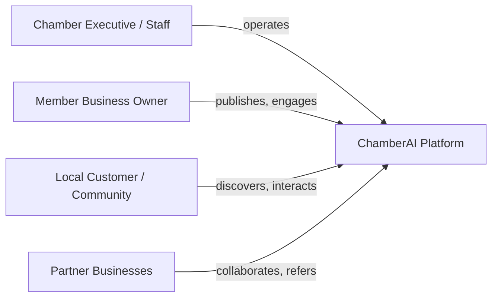
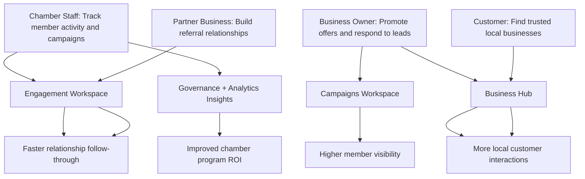
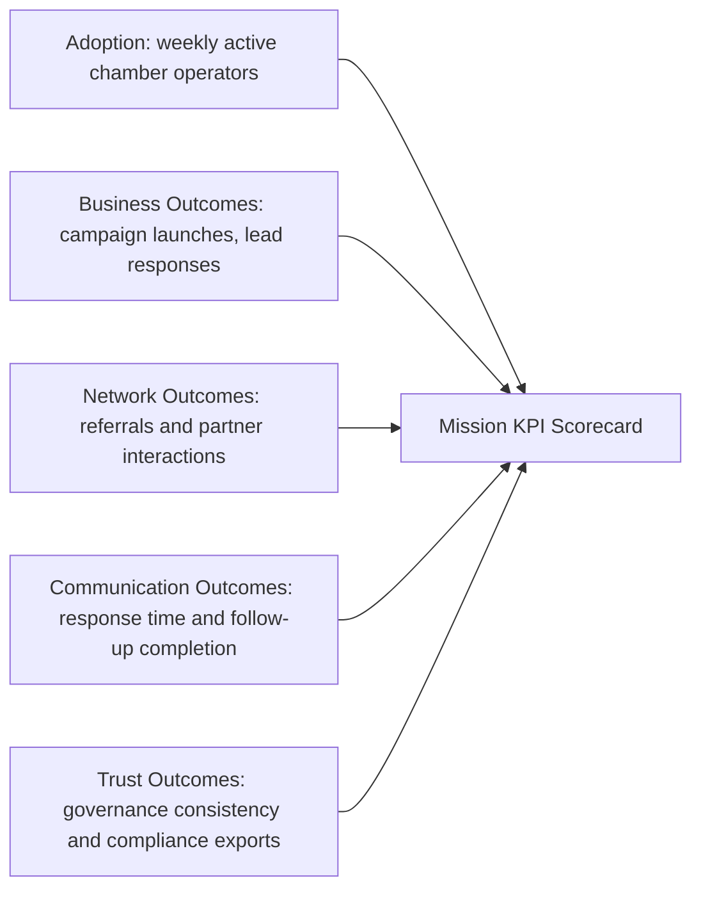
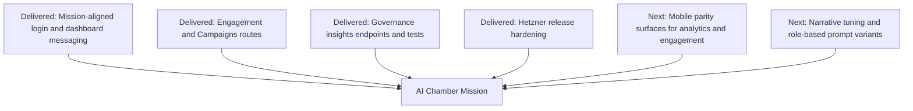

# AI Chamber Product Implementation Map

Date: 2026-03-31  
Product: ChamberAI

## Mission Alignment
ChamberAI is an AI-powered chamber platform that helps local businesses:
- advertise more effectively
- build stronger business relationships
- communicate with customers and nearby businesses

## User Types

## User Stories to Outcomes

## Success Criteria

## Deliverables (Implemented + Near-Term)

